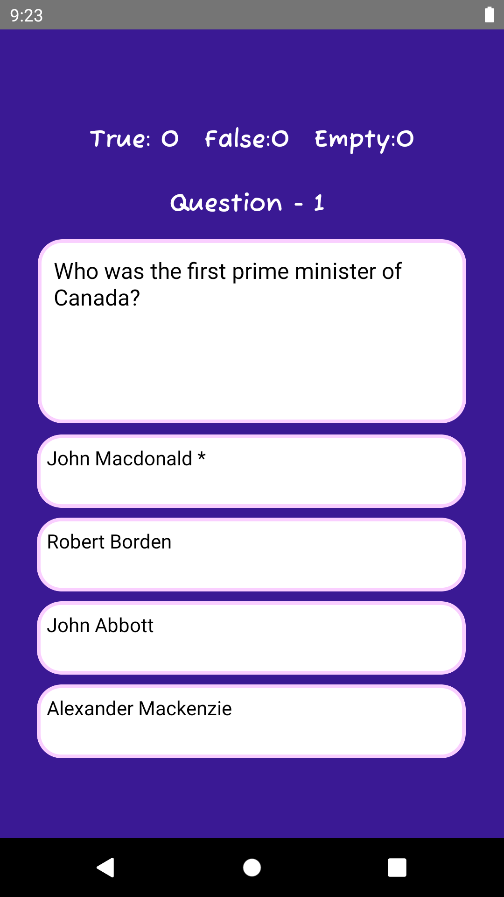
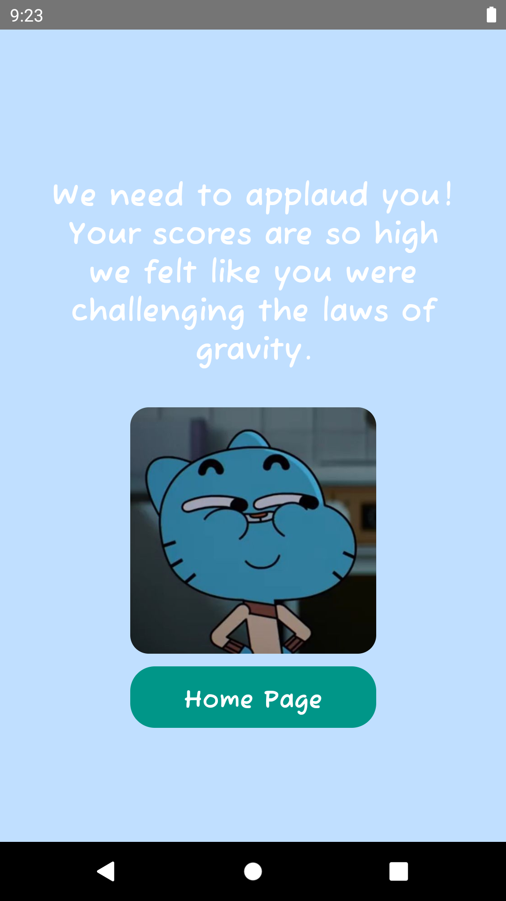
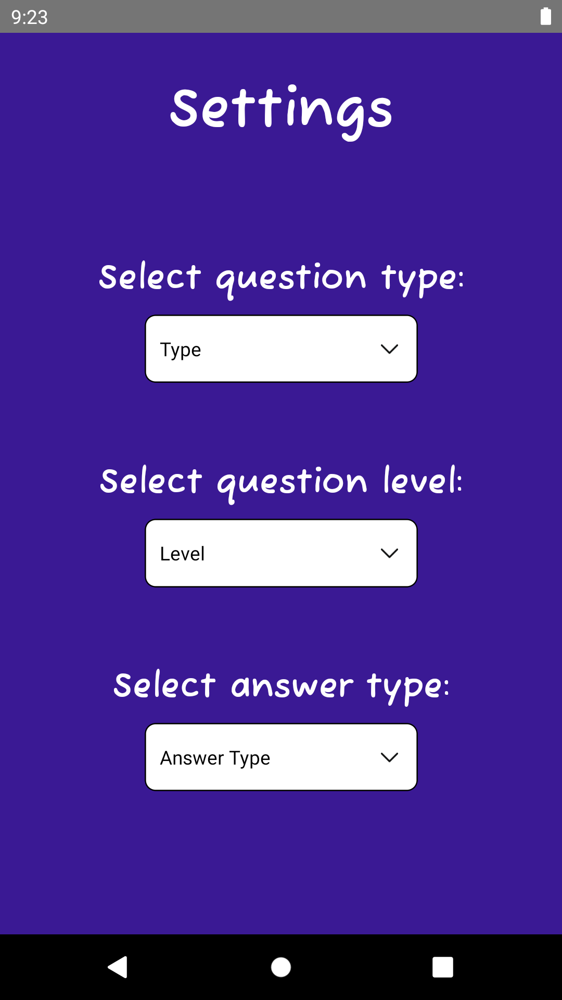

## Genel Bilgiler
1. Sayfalandırma için paketler indirildi ve redux indirildi.
1. Font için "https://blog.logrocket.com/adding-custom-fonts-react-native/" uygulandı.
1. Start yazısı için lottifiles kullanıldı. 
1. http adresleri için react-native-config indirildi ve .env dosyası oluşturuldu.
1. Fetch işlemi için axios paketi kuruldu.
1. Dropdown işlemi için react-native-dropdown-picker paketi kuruldu. 
1. redux kuruldu.
1. Oyundan çıkınca veya oyunu bitirince stack sıfırlama işlemi yapıldı (ResetStackOnExit)
1. Animasyonlu çizgi oluştuurlması için "react-native-reanimated" "react-native-gesture-handler" paketleri indirildi.

## Görseller

